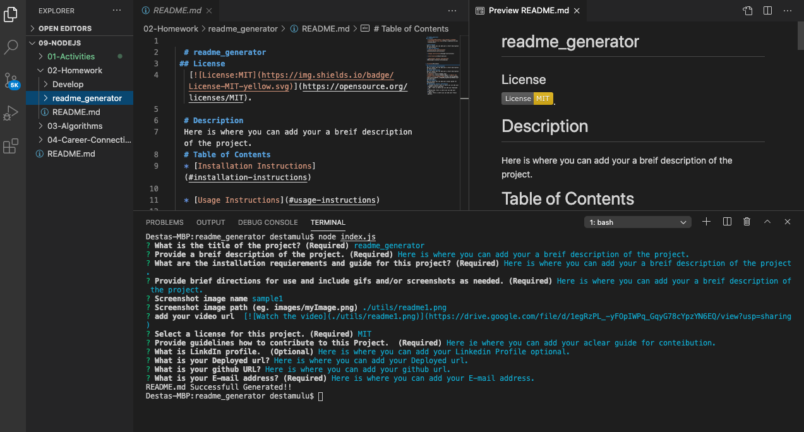

  # Read_generator
 ## License
   .

  # Description
  Here is where you can add your a breif description of the project.
  # Table of Contents
  * [Installation Instructions](#installation-instructions)
  
  * [Usage Instructions](#usage-instructions)
  
  * [Contribution](#Contribution)
  
  * [Developers Contact Information](#Developers-Contact-Information)
  
  
* [License](#license)

  ## Installation Instructions
   Here is where you can add your a breif description of the project.
  ## Usage Instructions
  Here is where you can add your directions for use.you can include gif or Screenshots.
  
  
  ## Contribution
  Here is where you can add your a clear guide for contribution.
  ## Developers Contact Information
   * LinkdIn Profile: Here is where you can add your Linkedin profile optional.
   * URL : Here is where you can add your Deployed url.
   * github URL: Here is where you can add your github url.
   * Email: Here is where you can add your E-mail address.
   
