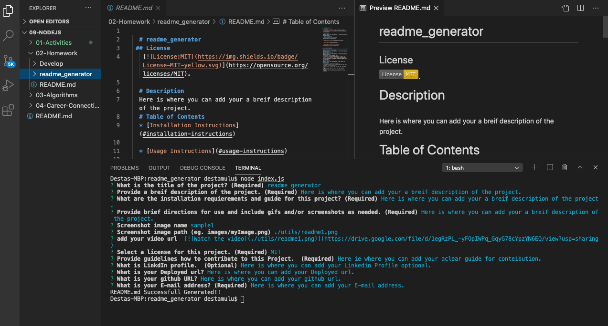

# README-GENERATOR
 ## License
   

  # Description

  This application is developed to help project developers to save time in generating thier README.md markdown.

  # Table of Contents

  * [Installation Instructions](#installation-instructions)
  
  * [Usage Instructions](#usage-instructions)
  
  * [Contribution](#Contribution)
  
  * [Developers Contact Information](#Developers-Contact-Information)
  
  
* [License](#license)

  ## Installation Instructions

  The developer is authorizing a free installation by cloning from the repo code [
    destish21/
   readme_generator](https://github.com/destish21/readme_generator).
  
  ## Usage Instructions

   For the this app to run make sure first 
   intall the node_moduale by

    `npm i or npm install`

    `node index.js`
   * make sure creat in your repository 

   * Copy the code from the code 
   [destish21/
   readme_generator](https://github.com/destish21/readme_generator) 
   readme_generator and clone it in your comand line.

  * Make sure node and npm is installed in your computer.

  * Once in the directory run npm install to install the node_modules needed to run the app.
  Run node index.js

  * You will be prompted with questions.

  * A "README.md Successfull Generated!!"  will be desplayed after answering all the questions.

  * My README.md is in my repo enjoy it !
  * screenshot image demo
 
  
  
  ### Click the demo image to see video 1 and video 2 demonstration:  

    
    
    
  
  ## Contribution
  
  This is Contributed by [destish21/readme_generator](https://github.com/destish21/readme_generator)
  But Contribution, issues and feature requests are welcome.

  Feel free to check issues page if you want to contribute.
  ## Developers Contact Information
   * LinkdIn Profile: [Desta Mulualem](https://www.linkedin.com/in/desta-mulualem-6718b1203/)
   * URL : N/A
   * github URL: https://github.com/destish21/readme_generator
   * Email: destish21@yahoo.com
   
