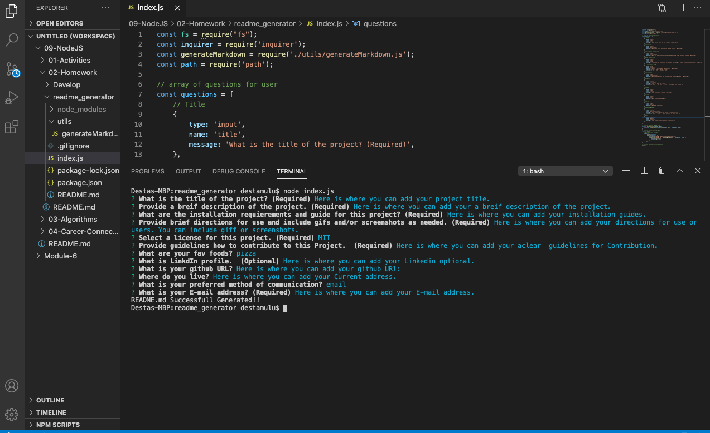

  # Title
 ## License
   .

  # Description
   Here is where you can add your a breif description of the project.
  # Table of Contents
  * [Installation Instructions](#installation-instructions)
  
  * [Usage Instructions](#usage-instructions)
  
  * [Contribution](#Contribution)
  
  * [Developers Contact Information](#Developers-Contact-Information)
  
  
* [License](#license)

  ## Installation Instructions
  Here is where you can add your installation guides.
  ## Usage Instructions
  Here is where you can add your directions for use or users. You can include giff or screenshots.
  
  
  ## Contribution
  Here is where you can add your aclear  guidelines for Contribution.
  ## Developers Contact Information
   * LinkdIn Profile: [Desta Mulualem](https://www.linkedin.com/in/desta-mulualem-6718b1203/)
   * URL : N/A
   * github URl: https://github.com/destish21/readme_generator
   * Email: destish21@yahoo.com
   